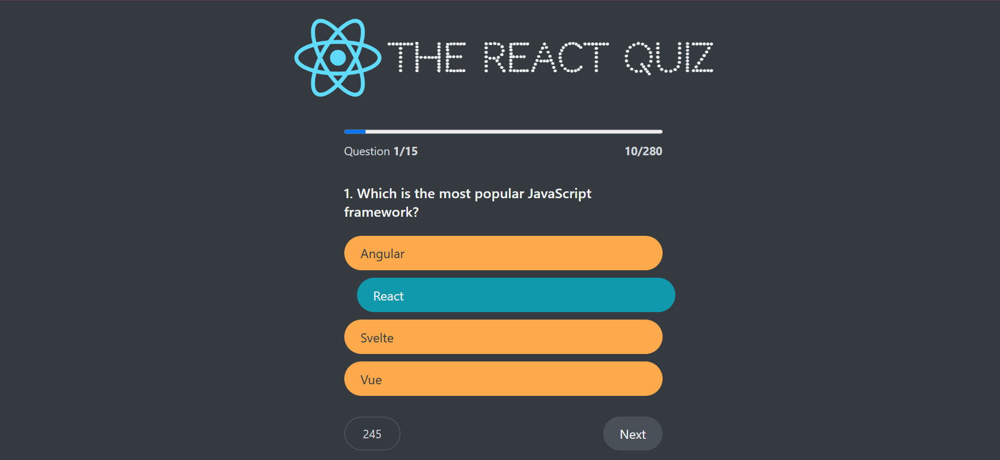

# React Quiz

A lightweight, Vite-powered React quiz app with timed questions and a finish screen.

## Screenshot



## Features

- Multiple-choice questions loaded from `data/questions.json`
- Timer per question
- Progress and score tracking
- Start and finish screens with results
- Minimal, component-based React structure

## Tech stack

- React + JSX
- Vite
- Plain CSS

## Getting started

Prerequisites:

- Node.js 16+ and npm or Yarn

Install dependencies:

```bash
npm install
```

Run the dev server:

```bash
npm run dev
```

Build for production:

```bash
npm run build
```

Preview production build:

```bash
npm run preview
```

## Project structure

- `index.html` — app entry HTML
- `src/main.jsx` — React entry
- `src/components/` — app components (App.jsx, Main.jsx, Question.jsx, Options.jsx, etc.)
- `data/questions.json` — quiz questions and options
- `public/` — static assets

## Usage

1. Open the app in the browser at the dev server URL (usually `http://localhost:5173`).
2. Click Start to begin the quiz.
3. Answer questions before the timer runs out.
4. View results on the finish screen.

## Customizing questions

Edit `data/questions.json` to add or modify questions. Each question should include the prompt, options, and correct answer.

## Contributing

Contributions welcome — open an issue or PR with fixes or improvements.

## License

MIT
